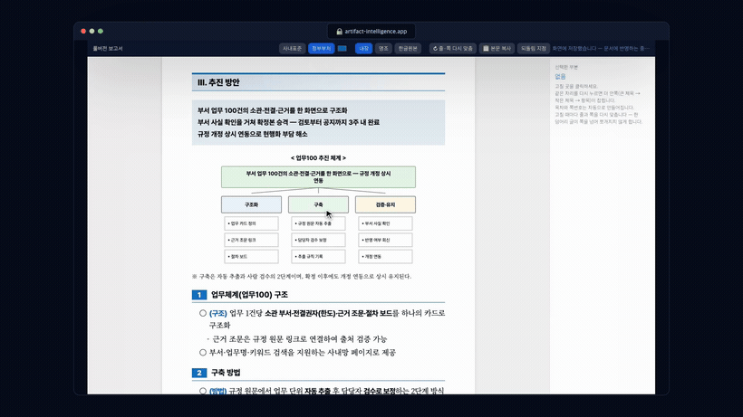

<div align="center">

# 문서지능 · Artifact Intelligence

**무엇을·누구에게·왜 보고할지와 사실·수치만 넘기면, 결재에 올릴 수 있는 문서 초안이 나옵니다.**  
목차 잡기·개조식 변환·한 장 맞춤·한글(HWPX) 변환은 규칙이 알아서 합니다. 사람은 맞는지 보고 고칠 데만 짚습니다.

먼저 써 보기 — 설치 없이 **https://artifact-intelligence.app**


</div>

---

<!-- DEMO-VIDEO -->
### 시연 영상

의도와 자료만 넣으면 → AI가 문서 구조를 설계하고 → 완성 문서를 → 도식·문구까지 항목별로 손쉽게 편집하고 → 한글(HWPX)로 내려받습니다.

[](docs/promo/promo.mp4)

▶ **[전체 영상 보기 (41초)](docs/promo/promo.mp4)** · 설치 없이 먼저 써 보기 — **https://artifact-intelligence.app**

---

## 일하는 방식을 바꿉니다

워드·한글은 빈 화면을 주고 사람이 다 채웁니다. 문서지능은 AI와 사람이 함께 일하도록 방식을 바꿉니다 — AI가 읽고 세우고 만들고 검사하면, 사람은 판단합니다. 실무자 한 명이 옆에 붙은 것에 가깝습니다.

- **의도와 맥락만 주면 됩니다.** "무엇을·누구에게·왜"와 사실·수치만 넘기면 결재에 올릴 초안이 나옵니다. 서식·목차·문체를 미리 정해 줄 필요가 없습니다.
- **검수 여부는 직접 고르시면 됩니다.** 바로 완성은 검수 없이 끝까지 만들어 파일로 드리고, 확인할 곳은 끝에 모아 알려 드립니다. 함께 검수는 초안을 쓰기 전에 어떤 유형으로 볼지, 목차를 어떻게 잡을지 먼저 보여 드리고, 승인하시면 그때 씁니다. "이건 검토보고가 아니라 결과보고였네" 같은 착오를 내용을 쓰기 전에 바로잡을 수 있습니다.
- **확인할 곳은 목록으로 드립니다.** 비워 둔 칸(○○), 자료에 없는 값, 직접 셈한 값, AI로 만든 그림처럼 사람이 한 번 봐야 할 곳을 모아 알려 드립니다.
- **AI가 만들고, 사람이 검증합니다.** 백지에서 시작하지 않으니 빠르고, 규칙이 품질을 받쳐 주니 흔들리지 않습니다.
- **결과물은 HTML로, 최종본은 한글(HWPX)로.** 표·도식·삽화로 살아 있는 문서를 만들고, 그대로 한글 파일로 옮깁니다.
- **쓸수록 좋아집니다.** 사람이 고친 곳을 규칙이 배웁니다. 실무자의 손길이 쌓일수록 다음 문서가 더 정확해집니다.

품질을 **구성·문체·디자인** 세 가지로 봅니다 — 정보 흐름과 목차, 개조식 명사형 종결과 번역투 금지, 마커와 시각 위계. 실물 보고서 1만 6천여 건에서 뽑은 작성 규칙으로 이 셋을 맞추고, 서술식 종결·한 장 초과·없는 수치를 검증 게이트가 막습니다. 걸리면 스스로 고쳐 다시 냅니다.

## 결재에 올리는 문서, 여섯 가지

| 문서 | 용도 | 출력 |
|---|---|---|
| **1페이지 보고서** | 의사결정자에게 한 장으로 | HTML·PDF·HWPX |
| **풀버전 보고서** | 표지·목차·본문을 갖춘 여러 장 | HTML·PDF·HWPX |
| **시행문** | 외부 기관·국민 대상 공문 | HTML·PDF·HWPX |
| **규정** | 제정·개정 조문 | HTML·PDF·HWPX |
| **보도자료** | 언론 배포 | HTML·PDF·HWPX |
| **발표 슬라이드** | 정책보고·브리핑(16:9) | HTML·PDF·PPTX |

문서마다 정해진 서식이 있어, 같은 내용은 어느 환경에서든 글꼴까지 똑같이 나옵니다.

- **규정**은 조 번호 인용·금액 띄어쓰기 같은 법제 표기를 맞춥니다. 자료에 없어 AI가 정하거나 비워 둔 곳은 따로 여쭙니다.
- **발표 슬라이드**는 새 판형이 생겼습니다. AI는 장마다 어떤 부품(차트·표·핵심 수치 등)을 둘지만 쓰고, 그리는 일은 조립기가 맡습니다. 이전 판형으로 만든 문서도 그대로 열립니다.
- **내보내기**는 문체·조판·자료 대조 검사를 통과한 판만 냅니다. 내보낸 파일은 `build/exports/` 에 생깁니다.

## 그림과 첨부 사진

- 구조와 수치는 도식·차트로 그립니다. 발표 슬라이드를 PPTX로 낼 때는 차트를 PowerPoint의 '데이터 편집'으로 고칠 수 있는 차트로 넣습니다(넣지 못하는 차트는 그림으로 들어갑니다).
- 올린 PDF·사진 파일에서 쓸 만한 그림을 골라, 보이는 자리만 잘라 넣습니다.
- 한글·워드 문서(HWP·HWPX·DOCX) 속 사진은 꺼내 쓰지 않습니다. 화면에 보이는 것과 문서 속 원본이 다를 수 있어서입니다. 넣고 싶으시면 그 문서를 PDF로 저장해 함께 올리시거나 사진 파일(PNG·JPG)로 올려 주세요.
- 그림을 싣는 자리는 풀버전 보고서 본문, 발표 슬라이드의 그림 장, 보도자료 끝의 붙임 사진입니다. 1페이지 보고서·시행문·규정에는 싣지 않습니다.
- AI 그림은 쓰시는 AI 도구에 이미지 생성 기능이 있을 때만, 먼저 여쭌 뒤 만듭니다. 만든 그림에는 'AI 생성물' 표기가 붙습니다. 실제 사람·기관을 사진처럼 꾸민 그림이나 사실을 주장하는 도해는 만들지 않습니다.

## 문서는 이 컴퓨터를 떠나지 않습니다

판정·작성·조립·검사·한글 변환까지, 문서를 만드는 일은 전부 설치한 컴퓨터에서 처리합니다. 작성 규칙도 설치본에 함께 들어 있어, 문서를 만드는 동안 서버에 규칙을 묻지 않습니다. 넘긴 자료도, 만든 초안도, 완성한 문서도 서버로 올라가지 않습니다.

예외는 하나입니다. 편집 화면의 'AI로 고치기'를 내 API 키 없이 쓰면, 고른 글 조각(표 칸 포함)만 서버 모델로 보내 고칩니다. 내 키를 넣으면 브라우저가 그 키로 모델을 바로 부릅니다. 이 밖에 서버와 주고받는 것은 새 버전 확인처럼 문서 내용이 실리지 않는 것뿐입니다.

## 작성 규칙은 모두 공개합니다

문서지능이 따르는 작성 규칙 227장을 **[규칙마당](https://rules.artifact-intelligence.app)** 에 펼쳐 두었습니다. 규칙마다 표본 문서의 어느 자리에 적용되는지 보여 드리고, 현장 관행과 다르면 의견을 받아 규칙에 반영합니다.

규칙만 필요하면 경량 스킬을 받아 쓰면 됩니다. 마크다운 파일 열네 개로 된 묶음이라 플러그인 없이 평소 쓰는 AI에 바로 붙일 수 있습니다.

- **내려받기**: [`rules-skill/artifact-intelligence-rules.zip`](rules-skill/artifact-intelligence-rules.zip) — 규칙마당에서 받는 것과 같은 파일입니다.
- **Claude Code**: 압축을 풀어 나온 `artifact-intelligence-rules` 폴더를 `~/.claude/skills/` 아래에 둡니다.
- **claude.ai**: 사용자 지정(Customize) → 스킬(Skills)에서 zip 파일을 풀지 않고 그대로 올립니다.
- **Codex·OpenClaw**: 압축을 풀어 나온 폴더를 `~/.agents/skills/` 아래에 둡니다.

규칙 원본(온톨로지)은 이 플러그인에도 들어 있습니다(`artifact-intelligence/ontology/ontology.json`). 규칙마당을 만드는 코드와 웹앱까지 담은 전체 소스는 소스 리포 [Artifact-Intelligence-source](https://github.com/Kminer2053/Artifact-Intelligence-source)에 있습니다.

## 설치

> **진입은 클라이언트마다 자리가 다릅니다**(스킬·MCP 노출 방식이 달라서 — 고장이 아닙니다). 어디서든 **"문서지능 도와줘"** 라고 치면 됩니다. `/` 로 부르려면: Claude Code = `/문서지능`, Codex = `/skills` → artifact-intelligence, Cursor = `/문서지능`(아래 `.cursor/commands/` 복사 후).

**Claude Code** — 마켓플레이스로:
```
/plugin marketplace add Kminer2053/Artifact-Intelligence-public
/plugin install artifact-intelligence@artifact-intelligence
```
진입: `/문서지능` 또는 "문서지능 도와줘".

**Codex** — 플러그인 마켓플레이스로(클론 불필요):
```bash
codex plugin marketplace add Kminer2053/Artifact-Intelligence-public
codex plugin add artifact-intelligence@artifact-intelligence
```
Python 3.10+ 필요. 한글(HWPX)·업로드·그림 처리까지 쓰려면 설치된 플러그인 폴더(`codex plugin list` 로 경로 확인)에서 `bash bin/bootstrap.sh` 를 한 번 실행하세요. 진입: **새 세션**에서 `/skills` → artifact-intelligence(설치 직후엔 스킬 목록 갱신에 새 세션이 필요), 또는 "문서지능 도와줘". (Codex `/` 상단 메뉴는 `/plugins`·`/skills`·`/mcp` 내장 명령만 보입니다.)

**Cursor** — MCP 서버 + 규칙으로 붙입니다:
```bash
git clone https://github.com/Kminer2053/Artifact-Intelligence-public
cd Artifact-Intelligence-public/artifact-intelligence
bash bin/bootstrap.sh
mkdir -p ~/.cursor/rules ~/.cursor/commands
cp .cursor/rules/artifact-intelligence.mdc ~/.cursor/rules/   # 작업 안내 규칙(자동 적용)
cp .cursor/commands/문서지능.md ~/.cursor/commands/           # /문서지능 슬래시 명령(Cursor 1.6+)
```
그다음 `~/.cursor/mcp.json` 의 `mcpServers` 에 아래를 추가하고 Cursor를 재시작하세요(`<경로>` 는 위 폴더의 절대경로):
```json
"artifact-intelligence": { "command": "<경로>/mcp/run.sh" }
```
Cursor는 MCP **도구**(판정·조립·게이트·내보내기)로 동작합니다. **진입**: `/` 를 치면 `/문서지능` 명령이 뜨거나(위 `.cursor/commands/` 복사 후, Cursor 1.6+), **"문서지능 도와줘"**라고만 입력해도 됩니다. 진행 방식(바로 완성·함께 검수)을 정하는 것부터 차례로 안내합니다.

**웹앱** — 설치 없이 https://artifact-intelligence.app 에서 바로 씁니다.

설치하면 첫 기동 때 한글(HWPX)·업로드·그림 처리에 필요한 것을 한 번에 준비합니다.

### 필요한 것

- 파이썬 3.10 이상
- 크롬(조판 검사·PDF), poppler(`pdftotext`·`pdftoppm`), Node(`npm`, 파일 업로드 파서)
- 인터넷은 첫 설치(pip·npm)와 새 버전 확인, 키 없이 쓰는 'AI로 고치기'에만 씁니다. 크롬이 없으면 실행할 때 설치 방법을 안내합니다.

## 바뀐 점

### 0.4.0 (2026-10-01)

- **작성 규칙을 설치본에 함께 담았습니다.** 규칙 원본(온톨로지)을 공개하면서 플러그인에도 넣었습니다. 문서를 만드는 동안 서버에 규칙을 묻지 않습니다.
- **진행 방식 두 가지.** 바로 완성(검수 없이 끝까지, 확인할 곳은 끝에 모아 알림)과 함께 검수(구성안 승인·편집 화면 리터칭) 가운데 고르실 수 있습니다. 한 번 고른 방식은 기억해 둘 수 있습니다.
- **확인할 것 목록.** 비워 둔 칸, 자료에 없는 값, 직접 셈한 값, AI 그림을 모아 알려 드립니다.
- **자료 대조를 넓혔습니다.** 숫자를 단위·배율(만·억 등)까지 함께 견줍니다. 그래도 모든 표기를 다 잡지는 못하니 금액·기간·날짜는 한 번 맞춰 봐 주세요.
- **그림.** 올린 PDF·사진에서 보이는 자리만 잘라 넣습니다. 한글·워드 문서 속 사진은 PDF나 사진 파일로 올려 주세요. AI 그림은 이미지 생성 도구가 있을 때만 만들고 'AI 생성물'로 표시합니다.
- **발표 슬라이드 새 판형**과 PPTX 편집 가능 차트를 넣었습니다.
- **규정 법제 표기**(조 번호 인용·금액 띄어쓰기)를 정리하고, 자료에 없어 AI가 정한 곳은 따로 여쭙니다.
- **파일 읽기(kordoc 4.16.3).** 스캔 PDF는 글자가 없는 쪽만 OCR로 읽어 합칩니다.
- **보안을 강화했습니다.** 문서 키·작성 계획·장르 이름이 파일 경로를 벗어나지 못하게 막고, 첨부 그림 원본은 그 작업의 자료 폴더 안에서만 읽습니다.
- **0.3.x에서 올라오실 때 달라지는 점.** 내보내기는 검사를 통과한 판만 내고, 파일은 `build/exports/` 에 생깁니다. 자료 원문 없이 만든 문서는 내보내지 않습니다(자료가 없으면 요청하신 글을 원문으로 씁니다).
- **라이선스를 밝혔습니다.** 코드는 MIT이고, 함께 담은 글꼴과 한글 서식 데이터의 고지는 `THIRD-PARTY-NOTICES.md` 에 모았습니다.

## 라이선스

이 프로젝트의 코드는 MIT 라이선스로 공개합니다([LICENSE](LICENSE)). 함께 담은 글꼴(SIL OFL 1.1)과 한글 서식 데이터(Apache-2.0)의 라이선스는 [THIRD-PARTY-NOTICES.md](THIRD-PARTY-NOTICES.md)에 정리해 두었습니다.

---

<div align="center"><sub>공공기관 보고서 작성을 도구로 열어 둡니다. 문의: park2053@gmail.com</sub></div>
